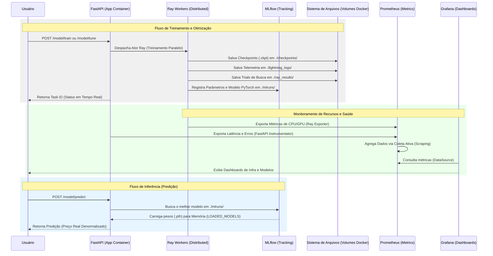

# Previsão de Preço de Ações com Deep Learning

Este projeto é uma plataforma robusta para treinamento, otimização e deploy de modelos de Deep Learning (LSTM e MLP) voltados para a previsão de preços de ações. A arquitetura utiliza tecnologias de ponta para garantir escalabilidade, rastreabilidade e monitoramento em tempo real.

## 🚀 Tecnologias Utilizadas

*   **FastAPI**: Framework web moderno e de alto desempenho para a construção da API.
*   **Ray**: Plataforma de computação distribuída usada para orquestrar treinamentos paralelos e busca de hiperparâmetros (Ray Tune).
*   **PyTorch & Lightning**: Frameworks para construção e treinamento simplificado de redes neurais.
*   **MLflow**: Ferramenta para gerenciamento do ciclo de vida de machine learning (rastreamento de experimentos, registro de modelos e artefatos).
*   **Prometheus & Grafana**: Conjunto para coleta de métricas e visualização de dashboards (incluindo métricas do Ray e da API).
*   **yfinance**: Biblioteca para download de dados históricos de ações.
*   **Docker & Docker Compose**: Containerização total para facilitar o desenvolvimento e deploy.

---

## 🏗️ Arquitetura e Fluxo de Dados Detalhado

O diagrama abaixo ilustra a interação entre os containers, os serviços de monitoramento e os diretórios onde os artefatos são gerados:



---

## 📂 Estrutura do Projeto

```text
.
├── data/                  # Dados do yfinance (raw e processed)
├── mlruns/                # [MLflow] Metadados e artefatos das execuções (runs)
├── mlflow.db              # [MLflow] Banco de dados SQLite (se configurado backend DB)
├── checkpoints/           # [Lightning] Salva os pesos (.ckpt) do melhor modelo durante o treino
├── lightning_logs/        # [Lightning] Logs padrão e telemetria do PyTorch Lightning
├── ray_results/           # [Ray Tune] Resultados, logs e checkpoints dos trials de tuning
├── src/
│   ├── api/               # Endpoints da aplicação FastAPI
│   ├── models/            # Arquiteturas de Redes Neurais (LSTM, MLP)
│   ├── services/          # Lógica de negócio (Pipeline, Tuning, Optimization)
│   ├── schemas/           # Modelos Pydantic para validação de API
│   └── registry/          # Registro de estados de tarefas (Ray Actors)
├── grafana_dashboards_prov.yaml # [Grafana] Configuração para carregar dashboards automaticamente
├── grafana_datasource.yml # [Grafana] Configuração da conexão com o Prometheus
├── main.py                # Ponto de entrada da aplicação
├── docker-compose.yml     # Orquestração de serviços (App, Prometheus, Grafana)
└── Dockerfile             # Definição do container da aplicação (com suporte a GPU)
```

---

## 🔍 Detalhes dos Componentes Gerados

Muitos arquivos e diretórios são criados automaticamente pelos frameworks utilizados:

*   **`checkpoints/`**: Criado pelo PyTorch Lightning (`ModelCheckpoint`). O `pipeline_service` instrui o Lightning a salvar aqui o estado da rede neural sempre que a perda de validação (`val_loss`) atinge um novo mínimo. É essencial para recuperar o modelo após o treino.
*   **`mlruns/`**: Criado pelo MLflow. Contém pastas numeradas para cada experimento. Dentro de cada pasta, há metadados (parâmetros, métricas) e os modelos salvos em formato serializado. O `MLFlowManager` utiliza este diretório para consultar e carregar modelos.
*   **`ray_results/`**: Criado pelo Ray Tune durante a execução do `tuning_service`. Armazena o histórico de cada "trial" (amostra de hiperparâmetro). Se um tuning for interrompido, o Ray pode usar esses arquivos para retomar de onde parou.
*   **`lightning_logs/`**: Logs operacionais do Lightning. Útil para depurar erros de baixo nível na GPU ou problemas internos do PyTorch.
*   **`grafana_dashboards_prov.yaml` / `datasource.yml`**: Criados manualmente para configurar o ambiente. O Grafana lê esses arquivos ao iniciar para saber onde o Prometheus está e quais gráficos de métricas exibir automaticamente.

---

## ⚙️ Como Executar

### Pré-requisitos
*   Docker e Docker Compose instalados.
*   (Opcional) NVIDIA Container Toolkit para suporte à aceleração por GPU.

### Passo a Passo

1.  **Subir os serviços**:
    ```bash
    docker-compose up --build
    ```

2.  **Acessar as interfaces**:
    *   **API (Swagger)**: [http://localhost:8000/docs](http://localhost:8000/docs)
    *   **Ray Dashboard**: [http://localhost:8265](http://localhost:8265)
    *   **MLflow (Rastreamento)**: [http://localhost:5000](http://localhost:5000)
    *   **Grafana**: [http://localhost:3000](http://localhost:3000) (Login padrão: `admin` / `admin`)
    *   **Prometheus**: [http://localhost:9090](http://localhost:9090)

---

## 📊 Fluxo de Dados e Treinamento

1.  **Coleta**: O endpoint `/data/download` utiliza a `StockDataLoader` para baixar CSVs via `yfinance`.
2.  **Processamento**: A classe `TimeSeriesDataModule` aplica a "Window Normalization" (normalização por janela) utilizando o último valor da janela como base. Isso foca a previsão no **retorno relativo** em vez do preço bruto, reduzindo vieses de tendência.
3.  **Treinamento**: O `pipeline_service` dispara um ator remoto do Ray que treina o modelo selecionado e salva o melhor checkpoint automaticamente no MLflow.
4.  **Tuning**: O `tuning_service` utiliza o Ray Tune com o algoritmo ASHA para disparar múltiplos trials simultâneos, encontrando a melhor combinação de hiperparâmetros.

---

## 🛣️ Endpoints Principais (Exemplos)

### Treinamento (`/model/train`)
Exemplo de corpo da requisição:
```json
{
  "model_type": "lstm",
  "hidden_dim": 64,
  "num_layers": 2,
  "dropout_prob": 0.2,
  "learning_rate": 0.001,
  "window_size": 60
}
```

### Predição (`/model/predict`)
Realiza a previsão do próximo preço. Se o `ticker` for fornecido e a lista de `data` estiver incompleta, o sistema busca automaticamente os dados históricos para completar a janela necessária para o modelo.

### Otimização e Pruning (`/model/prune`)
Aplica a técnica de "L1 Unstructured Pruning" para reduzir o tamanho do modelo, removendo conexões neurais menos significativas, e registra uma nova versão do modelo no MLflow.

---

## 🩺 Saúde dos Experimentos

O que chamamos de "saúde dos experimentos" é a capacidade de monitorar se o aprendizado do modelo é eficaz e estável. Isso é feito via:

1.  **Check de Overfitting**: Comparar a curva de `train_loss` com `val_loss` no MLflow. Se o erro de treino cair e o de validação subir, o modelo está "decorando" os dados.
2.  **Gradientes Saudáveis**: Verificar se as perdas não estão se tornando `NaN` (Not a Number), o que indicaria uma `learning_rate` muito alta ou falta de normalização.
3.  **Utilização de Recursos**: Através do Grafana/Prometheus, monitoramos se a GPU está sendo devidamente utilizada ou se há gargalo na CPU durante o processamento de dados do Ray.

---

## 📈 MLflow: Melhorando o Modelo e a Esteira

O Dashboard do MLflow permite uma análise profunda para evoluir o projeto:

### Através da Interface (UI)
*   **Comparação**: Selecione múltiplos "runs" de tuning e use o gráfico de **Coordenadas Paralelas** para visualizar qual combinação de hiperparâmetros resulta na menor perda.
*   **Reprodutibilidade**: Cada run registra a versão exata do código e os parâmetros. Você pode copiar a configuração de um modelo vencedor e usá-la como base para treinamentos mais longos.

### Através da Lógica (Pipeline)
*   **Pruning**: Use o endpoint `/model/prune` em modelos que performam bem mas são pesados. O MLflow registrará a versão "podada", permitindo comparar a perda de acurácia vs ganho de velocidade.
*   **Especialização (Finetuning)**: A esteira pode ser melhorada usando o MLflow para carregar pesos de uma ação (ex: AAPL) e especializá-la em outra (ex: MSFT), acelerando a convergência.
*   **Registro de Modelos**: Você pode marcar modelos como "Production" ou "Staging" via UI, controlando qual versão a rota de predição deve carregar.
